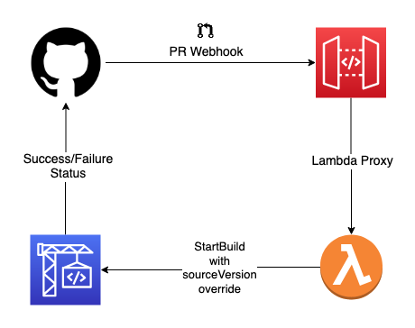
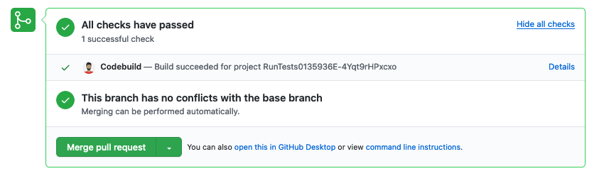

# Github automated PR build and status notification

This example creates a CI pipeline for automated Github pull requests builds and status notifications



## How it works?
Add a new webhook with the API Gateway stage endpoint as the **Payload URL** and _application/json_ as the **Content type**. Choose the events for which you want the build to be triggered, for example _Pull requests_.

When triggered, the json payload is forwarded to the Lambda function via API Gateway. The function extracts the pull request number from the payload and triggers a new Codebuild project build passing the pull request id as [sourceVersion](https://docs.aws.amazon.com/codebuild/latest/APIReference/API_StartBuild.html#CodeBuild-StartBuild-request-sourceVersion).

The Codebuild project is configured with the [reportBuildStatus](https://docs.aws.amazon.com/codebuild/latest/APIReference/API_ProjectSource.html#CodeBuild-Type-ProjectSource-reportBuildStatus) enabled. For Github source provider, Codebuild uses the [create commit status api](https://developer.github.com/v3/repos/statuses/#create-a-commit-status) to report the final build status along with a deep url to Codebuild console.



## Configurations

The following configurations are part of the CDK context. Defaults are added in the [cdk.json](./cdk.json) file.

* _github\_access\_token\_path_: The AWS Secrets Manager path where the Github Oauth token is stored. Default key is 'token'.
* _github\_repo\_owner_: Github repo owner
* _github\_repo\_name_: Repository name


# CDK for Python generic instructions (auto generated by cdk init)
Follow the [CDK getting started guide](https://docs.aws.amazon.com/cdk/latest/guide/getting_started.html) to install CDK.

This project is set up like a standard Python project. Create a virtualenv
and activate it. Once the virtualenv is activated, you can install the 
required dependencies.

```
$ pip install -r requirements.txt
```

At this point you can now synthesize the CloudFormation template for this code.

```
$ cdk synth
```

View the diff (or the list of resources if nothing has been deployed yet)
```
$ cdk diff
```

Deploy the changes
```
$ cdk deploy
```

To add additional dependencies, for example other CDK libraries, just add
them to your `setup.py` file and rerun the `pip install -r requirements.txt`
command.

## Useful commands

 * `cdk ls`          list all stacks in the app
 * `cdk synth`       emits the synthesized CloudFormation template
 * `cdk deploy`      deploy this stack to your default AWS account/region
 * `cdk diff`        compare deployed stack with current state
 * `cdk docs`        open CDK documentation

 Enjoy!
