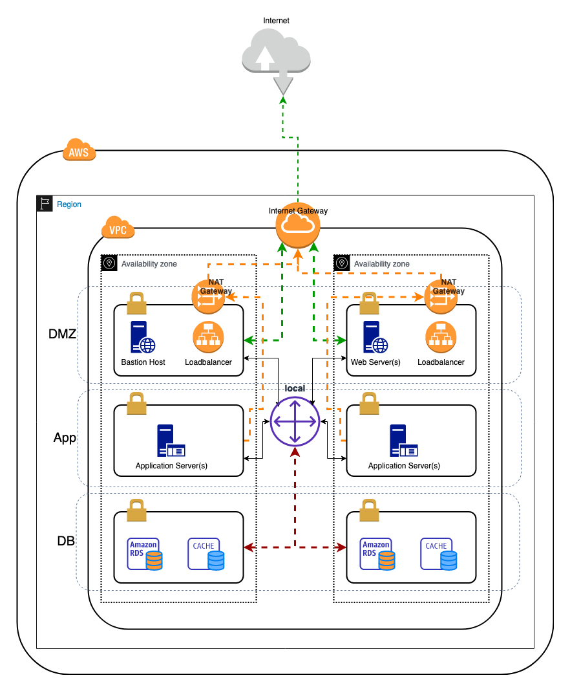

# VPC Baseline setup

This example creates a VPC and associated resources suitable for a standard
three tier architecture. Reference architecture diagram given below.


## Configurations
Some basic configuration parameters are exposed via the [config.yaml](./config.yaml)
file in the project directory.

* _region_: The AWS region to use
* _name_: Logical name for the VPC
* _cidr_: The CIDR range to use for the VPC
* _default\_instance\_tenancy_: Default tenancy of instances
* _enable\_dns\_hostnames_: Enable public DNS hostnames for instances
* _enable\_dns\_support_: Enable DNS resolution
* _max\_azs_: Number of AZs to use in the region
* _xxxx\_name_prefix_: Logical name prefix for the subnets
* _xxxx\_prefix_: Subnet CIDR prefix
* _xxxx\_buffer_: Subnets to reserve for future expansion

# CDK for Python generic instructions (auto generated by cdk init)
Follow the [CDK getting started guide](https://docs.aws.amazon.com/cdk/latest/guide/getting_started.html) to install CDK.

This project is set up like a standard Python project. Create a virtualenv
and activate it. Once the virtualenv is activated, you can install the 
required dependencies.

```
$ pip install -r requirements.txt
```

At this point you can now synthesize the CloudFormation template for this code.

```
$ cdk synth
```

To add additional dependencies, for example other CDK libraries, just add
them to your `setup.py` file and rerun the `pip install -r requirements.txt`
command.

## Useful commands

 * `cdk ls`          list all stacks in the app
 * `cdk synth`       emits the synthesized CloudFormation template
 * `cdk deploy`      deploy this stack to your default AWS account/region
 * `cdk diff`        compare deployed stack with current state
 * `cdk docs`        open CDK documentation
